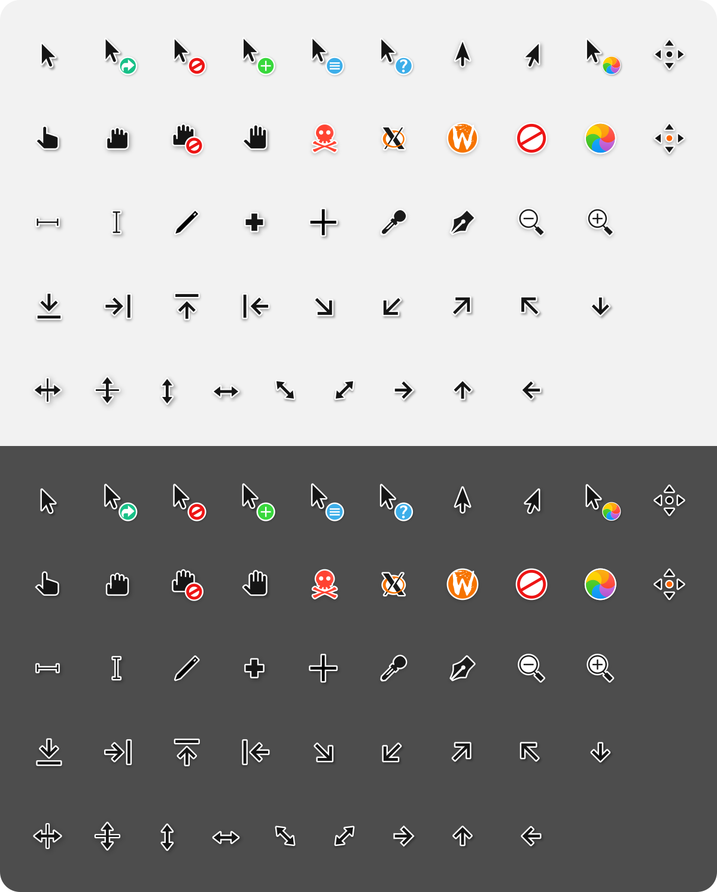

# McMojave-hyprcursor
The [McMojave cursor theme](https://github.com/vinceliuice/McMojave-cursors), created by [vinceliuice](https://github.com/vinceliuice) and ported to `hyprcursor`.

## Preview


## Installation
#### General
Downlaod the latest [release](ttps://github.com/Libadoxon/mcmojave-hyprcursor/releases) and the place the files into `~/.local/share/icons` or `~/.icons`. After that set the `HYPRCURSOR_THEME` variable to `McMojave` or `McMojave` in your `hyprland` config
```hyprlang
env = HYPRCURSOR_THEME,McMojave
```

#### NixOs
Add `mcmojave-hyprcursor` to your flake inputs. A basic flake would look like this
```nix
{
  description = "Basic System Flake";
  inputs = {
    nixpkgs.url = "github:nixos/nixpkgs/nixos-unstable";
    hyprland = {
      type = "git";
      url = "https://github.com/hyprwm/Hyprland";
      submodules = true;
    };

    # Add this line
    # vvvvvvv
    mcmojave-hyprcursor.url = "github:libadoxon/mcmojave-hyprcursor";
  };
  outputs = { self, nixpkgs, ... } @inputs: {
  nixosConfigurations = {
    exampleSystem = nixpkgs.lib.nixosSystem {
      specialArgs = { inherit inputs; };
      modules = [
        ./configuration.nix
      ];
    };
  };
}
```
After that install the wanted theme in your `configuration.nix` or `home.nix`
```nix
# configuration.nix
{ pkgs, inputs, ... }: {
  ...
  environment.systemPackages = [
      inputs.mcmojave-hyprcursor.packages.${pkgs.stdenv.hostPlatform.system}.default
  ];
  ...
}
```
```nix
# home.nix
{ pkgs, inputs, ... }: {
  ...
  home.packages = [
      inputs.mcmojave-hyprcursor.packages.${pkgs.stdenv.hostPlatform.system}.default
  ];
  ...
}
```
Set the environment variable so `hyprcursor` knows to use the the newly added theme. You can do this in your `NixOs` configuration
```
# configuration.nix
{ ... }: {
  ...
  environment.variables.HYPRCURSOR_THEME = "McMojave";
  ...
}
```
```
# home.nix
{ ... }: {
  ...
  home.sessionVariables.HYPRCURSOR_THEME = "McMojave";
  ...
}
```
or by appending `env = HYPRCURSOR_THEME,McMojave` to your `hyprland` config
